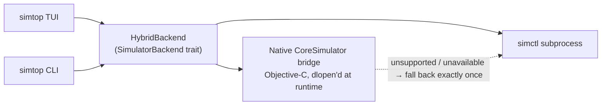

# simtop

**High-performance iOS Simulator management from the terminal.**

An interactive TUI and a one-shot automation CLI that share a single hybrid
backend: a native Objective-C CoreSimulator bridge for the hot paths, with
`simctl` as the fallback. Manage simulators with first-class keyboard and
mouse controls, or drive them from scripts and CI.

```
┌ simtop ───────────────────────────── gen 12 | 3 devices | refresh 2s ──┐
│ STATE          NAME                                                    │
│ booted         iPhone 16 Pro                                           │
│ shutdown       iPhone SE (3rd)                                         │
│ booting        iPad Pro 11                                             │
├────────────────────────────────────────────────────────────────────────┤
│ details: iPhone 16 Pro                                                 │
│   name  iPhone 16 Pro                                                   │
│   state booted                                                         │
│   os 18.0                                                               │
│   available yes                                                         │
│   actions: [s] shutdown  [o] open Simulator.app  [p] screenshot  [l] … │
└────────────────────────────────────────────────────────────────────────┘
[↑/↓] select  [Enter] boot/open  [b] boot  [s] shutdown  [/] search  [v] display  [?] help  [q] quit
```

Illustrative mock — run `simtop` for the real thing.

## Features

- **Interactive TUI** (ratatui): clickable tabs, device rows, project setup,
  action controls, and dialogs; wheel scrolling; searchable device list; state
  filter; live logs; and capability-aware operations.
- **One-shot CLI**: every TUI action exists as a subcommand, so the same
  backend drives interactive and scripted use.
- **Hybrid engine**: device discovery and lifecycle (list, boot, shutdown,
  create, delete) run through a CoreSimulator bridge loaded at runtime — no
  subprocess overhead on the hot paths. App operations, screenshots, and
  logs go through a typed `simctl` client. If the native bridge is missing
  or reports an unsupported operation, simtop falls back to `simctl`
  exactly once.
- **`--json` everywhere**: schema-v1 envelopes, one per line, never prompt —
  built for scripting.
- **Safe by design**: no shell passthrough or interpolation, UDIDs and
  bundle IDs are shape-validated, ambiguous selectors are rejected instead
  of silently resolved, and destructive commands confirm unless told not to.

## Requirements

- macOS 15 or later (Sequoia+)
- Xcode 16 (CoreSimulator and Simulator.app)
- Rust 1.74+ — only needed to build from source

## Installation

simtop has no published releases yet; build from source:

```bash
git clone https://github.com/noahlin34/simtop.git && cd simtop
cargo install --path .
```

Tagged releases (`v*`) build a universal arm64 + x86_64 binary and draft a
GitHub Release with the archive and checksum. A Homebrew formula ships in
`Formula/` and activates at the first release.

## Quick start

```bash
simtop                            # interactive TUI
simtop list                       # one-shot table of all devices
simtop list --json                # machine-readable snapshot
simtop boot "iPhone 16 Pro"       # address devices by unique name
simtop app launch 4A2F…9B com.example.MyApp
simtop app logs "iPhone 16 Pro" --follow
simtop screenshot 4A2F…9B --output screen.png
```

## Command reference

| Command | What it does |
|---|---|
| `simtop` | Open the interactive TUI |
| `simtop list` | Snapshot of every simulator (one shot) |
| `simtop watch [--interval N] [--count N]` | Print snapshots continuously until interrupted or `--count` is reached |
| `simtop boot <selector>` | Boot a device (idempotent) |
| `simtop shutdown <selector>` | Shut a device down (idempotent) |
| `simtop open <selector>` | Open Simulator.app focused on the device |
| `simtop create --name N --device-type ID --runtime ID` | Create a device from CoreSimulator identifiers |
| `simtop delete <selector>` | Delete a device (confirms interactively; never with `--json`/`--no-input`) |
| `simtop screenshot <selector> [--output PATH]` | Capture a PNG of the device screen |
| `simtop app install <selector> <path.app>` | Install an app bundle |
| `simtop app launch <selector> <bundle-id>` | Launch an installed app |
| `simtop app terminate <selector> <bundle-id>` | Terminate a running app |
| `simtop app uninstall <selector> <bundle-id>` | Uninstall an app |
| `simtop app logs <selector> [--follow]` | Print recent device logs; `--follow` streams new entries |
| `simtop app open-url <selector> <url>` | Open a URL (http(s) or custom scheme) inside the device |

Global flags (valid with every command):

| Flag | Meaning |
|---|---|
| `--json` | Machine-readable output on stdout; never prompts |
| `--developer-dir DIR` | Xcode developer directory override |
| `--timeout SECONDS` | Backend operation timeout (default 30) |
| `--no-input` | Never prompt for confirmation |

### Selectors

Commands that address a device take a **selector**, resolved deterministically:

1. an exact UDID wins;
2. otherwise the selector must match exactly one device name,
   case-insensitively.

Zero matches is a `DEVICE_NOT_FOUND` error; more than one is an
`INVALID_ARGUMENT` error listing the matching UDIDs. simtop never silently
picks an ambiguous simulator. Convenience selectors like `booted` are
intentionally rejected — pass a real UDID or name.

### JSON output

`--json` emits one envelope per line to stdout; all diagnostics go to
stderr. Success:

```json
{"schema":1,"command":"list","ok":true,"data":{"schema_version":1,"generation":3,"timestamp":"2026-08-09T12:00:00Z","devices":[{"udid":"4A2F…9B","name":"iPhone 16 Pro","state":"booted","device_type":"com.apple.CoreSimulator.SimDeviceType.iPhone-16-Pro","runtime":"com.apple.CoreSimulator.SimRuntime.iOS-18-0","os_version":"18.0","is_available":true}]}}
```

Failure:

```json
{"schema":1,"command":"boot","ok":false,"code":"DEVICE_NOT_FOUND","message":"no simulator matches selector \"ghost\"","exit_code":8}
```

The error `code` is a stable machine code and `exit_code` is deterministic,
so scripts can branch on failures without parsing messages.

### Exit codes

| Code | Category |
|---|---|
| 0 | Success |
| 1 | Aborted (user declined) |
| 2 | Invalid argument |
| 3 | Unsupported platform |
| 4 | Xcode not found |
| 5 | Invalid developer directory |
| 6 | Native bridge unavailable |
| 7 | Unsupported operation |
| 8 | Device not found |
| 9 | Command failed |
| 10 | Timeout |
| 11 | I/O error |
| 12 | Parse error |
| 70 | Internal error |

## Architecture

`src/main.rs` is a thin shim; all logic lives in the `simtop` library crate.
One async trait — `SimulatorBackend` — is the sole interface consumed by
both the TUI and the CLI, so a new operation is added once and appears in
both frontends.



- `src/backend/` — the trait, the hybrid policy, and the typed `simctl` client
- `src/native.rs` + `native/` — C ABI wrapper and the Objective-C CoreSimulator bridge
- `src/tui.rs` — the TUI state machine and rendering
- `src/cli.rs` — clap CLI, dispatch, selector resolution
- `src/model.rs` — schema-v1 domain types; the JSON wire format is a tested contract
- `src/error.rs` — error taxonomy with stable machine codes and exit codes

## Development

```bash
cargo run                  # launch the TUI
cargo test                 # unit tests + wire-contract tests
cargo build --release --locked
cargo fmt && cargo clippy  # not enforced by CI; keep the tree clean
```

See [CONTRIBUTING.md](CONTRIBUTING.md) for the full picture.

## Status

Early development (0.1.0).

## License

MIT — see [LICENSE](LICENSE).
